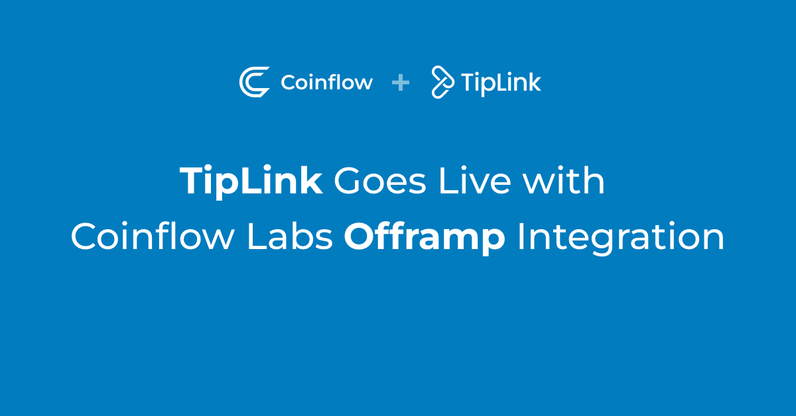

# TipLink Goes Live with Coinflow Labs Offramp Integration

Coinflow Labs, the leading payment solution for Web3 companies, has just announced the successful integration of its 
payment platform into TipLink, a fast-growing platform that aims to onboard the next 1 billion people into crypto by 
allowing users to easily send and receive cryptocurrency with a simple link.

Coinflow Labs provides a seamless payment solution for Web3 companies, allowing them to accept both traditional payment 
methods and cryptocurrency. With Coinflow, users can offramp any cryptocurrency directly from their crypto wallets 
directly to their US bank accounts. Coinflow's platform provides a seamless experience for both the merchant and the 
customer, making it an ideal offramp solution for any Web3 company.

TipLink is a platform that makes it easy for anyone to send and receive cryptocurrency by sharing a simple link. With 
TipLink, users can onboard their friends and family into crypto without the need for complicated wallet setups or 
lengthy explanations. TipLink's mission is to onboard the next 1 billion people into crypto by making it easy and 
accessible for everyone.

With the integration of Coinflow's offramp platform, TipLink's users will now have the option to withdraw their funds 
directly to their bank account, further expanding the platform's capabilities and convenience for users.

> “We are super excited to partner with the Coinflow team to offer off-ramping directly to your bank account, after testing out all of the solutions out there, Coinflow has managed to make something 
that simply just works. It’s a magical experience sending someone crypto/money with a link, without asking for any 
information or worrying about what platforms they use, and that person on the other side being able to directly move 
that value to their bank account. We’re eager to continue blurring the lines of crypto and payments with the talented 
Coinflow team.”

_Krotinsky, CEO of TipLink._

> "We are thrilled to be partnering with TipLink to help onboard more people into the world of crypto, by integrating our offramp solution into TipLink, we are making it even easier for non-crypto 
native users to seamlessly realize their value and improve the utility of TipLinks products. We look forward to a 
successful partnership and continued growth for both companies."

_Daniel Lev, CEO of Coinflow Labs._

The integration of Coinflow's payment platform into TipLink is a significant milestone for both companies and marks a 
major step forward in the adoption of cryptocurrency as a mainstream payment method.
